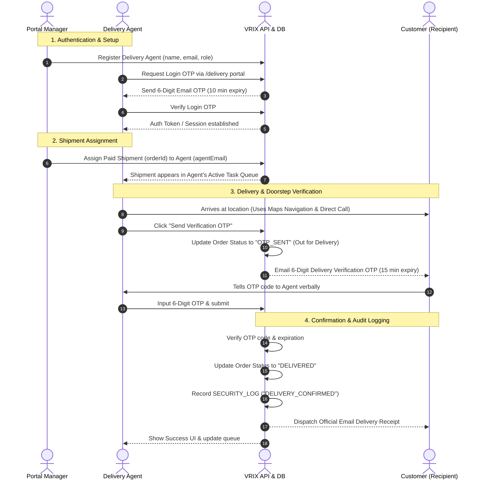

# 🚚 VRIX Delivery Operations Panel — Documentation & Workflow Guide

Welcome to the official documentation and technical workflow guide for the **VRIX Delivery Operations System**. This system provides secure OTP-based authentication, real-time shipment assignment, doorstep verification, and automated customer notifications for luxury jewelry deliveries.

---

## 📌 Table of Contents
1. [System Overview & Architecture](#-system-overview--architecture)
2. [User Roles & Permissions](#-user-roles--permissions)
3. [End-to-End Operational Workflow](#-end-to-end-operational-workflow)
4. [API Endpoints Reference](#-api-endpoints-reference)
5. [Database Schema & Data Models](#-database-schema--data-models)
6. [Frontend UI Components & Features](#-frontend-ui-components--features)
7. [Environment & Email Setup](#-environment--email-setup)
8. [Testing & Developer Guide](#-testing--developer-guide)

---

## 🏗️ System Overview & Architecture

The VRIX Delivery Panel is built as an integrated micro-system within the VRIX E-Commerce platform:

* **Frontend Routes:**
  * [`/delivery`](file:///Frontend/src/app/(shop)/delivery/page.tsx): Main Glassmorphic Delivery Operations Portal for staff (Agents & Managers).
  * [`/admin/delivery`](file:///Frontend/src/app/(admin)/admin/delivery/page.tsx): Admin Console sub-page for managing logistics staff accounts.
* **Backend Module:**
  * [`/api/delivery`](file:///Backend/routes/delivery.js): Express.js REST API handling authentication, assignment, OTP generation, doorstep verification, and security logging.
* **Database & Persistence:**
  * Managed via Prisma ORM interacting with SQLite / PostgreSQL.
* **Email Dispatch Engine:**
  * Integrated Nodemailer transporter with active API setting resolvers for OTP delivery and delivery confirmation receipts.

---

## 👤 User Roles & Permissions

| Role | Access Level | Responsibilities |
| :--- | :--- | :--- |
| **Portal Manager** | Admin / Manager | View all system shipments, assign orders to agents, register or revoke staff accounts, track overall metrics & delivery efficiency. |
| **Delivery Agent** | Field Operations | View assigned active shipments & open pool, navigate to customer locations, place calls to recipients, trigger & verify doorstep OTPs. |
| **Customer** | End-User | Receives email OTP when shipment is out for delivery, provides code to agent at doorstep, receives delivery receipt upon confirmation. |

---

## 🔄 End-to-End Operational Workflow



### Detailed Workflow Steps:

1. **Staff Registration & Authentication**
   - Manager adds staff via `/admin/delivery` or the Manager tab in `/delivery`.
   - Staff member logs in by entering their registered email address.
   - A 6-digit OTP code is dispatched to their email (valid for 10 minutes).
   - In dev mode (`SMTP` not configured), the code is logged directly to the server console.

2. **Shipment Assignment**
   - When orders are placed and paid (`status = "SUCCESS"`), they enter the delivery system pool.
   - Portal Manager assigns the shipment to a specific agent email.
   - Unassigned orders remain in the **Open Pool**, visible to agents for flexible pickup.

3. **Out-for-Delivery & OTP Generation**
   - Delivery agent navigates to customer's address using the built-in **Google Maps Navigation** link or contacts customer via direct phone link.
   - Upon arriving at the doorstep, the agent clicks **"Send Verification OTP"**.
   - Order status changes to `OTP_SENT` and a 6-digit code valid for 15 minutes is emailed to the customer.

4. **Doorstep Verification & Completion**
   - Customer shares the 6-digit OTP code with the agent.
   - Agent inputs the OTP into the workstation UI (supports manual entry & auto-paste).
   - Backend verifies the OTP:
     - On Success: Status changes to `DELIVERED`, a `DELIVERY_CONFIRMED` event is written to `securityLogs`, and an itemized **Delivery Receipt Email** is automatically sent to the customer.
     - On Failure: Error toast is displayed, allowing retry or resend.

---

## 📡 API Endpoints Reference

All endpoints are prefixed with `/api/delivery`.

| Method | Endpoint | Access Level | Description |
| :--- | :--- | :--- | :--- |
| `POST` | `/auth/login` | Public (Staff) | Sends a 6-digit login OTP to registered staff email (10 min expiry). |
| `POST` | `/auth/verify` | Public (Staff) | Validates login OTP and authenticates staff member. |
| `GET` | `/orders` | Staff (`agent`/`manager`) | Fetches delivery orders. Filters by agent email if `role=agent`. |
| `PATCH` | `/orders/:orderId/assign` | Manager | Assigns or unassigns an order to a delivery agent. |
| `GET` | `/staff` | Manager | Returns directory list of all registered delivery staff. |
| `POST` | `/staff` | Manager | Registers a new delivery agent or manager (`email`, `name`, `role`). |
| `DELETE` | `/staff/:email` | Manager | Revokes access for a staff member. |
| `POST` | `/send-otp` | Agent | Dispatches a 6-digit delivery OTP to customer & sets status to `OTP_SENT`. |
| `POST` | `/verify-otp` | Agent | Verifies customer OTP, updates status to `DELIVERED`, logs security event & emails receipt. |

---

## 🗄️ Database Schema & Data Models

Defined in Prisma [`schema.prisma`](file:///Backend/prisma/schema.prisma):

```prisma
model deliveryStaff {
  id        String   @id @default(uuid())
  email     String   @unique
  name      String
  role      String   // "agent" | "manager"
  createdAt DateTime @default(now())
  updatedAt DateTime @updatedAt
}

model payments {
  id            String   @id @default(uuid())
  orderId       String   @unique
  amount        Float
  currency      String   @default("INR")
  status        String   // "CREATED" | "SUCCESS" | "OTP_SENT" | "DELIVERED" | "FAILED"
  paymentId     String?
  customerName  String?
  customerPhone String?
  address       String?
  city          String?
  postalCode    String?
  userEmail     String?
  assignedAgent String?  // Stores email of delivery staff
  createdAt     DateTime @default(now())
  updatedAt     DateTime @updatedAt
}

model verificationOtps {
  id        String   @id @default(uuid())
  email     String   // Format: "delivery_auth:staff@email.com" OR "delivery:ORD-12345"
  otp       String
  expiresAt String
}

model securityLogs {
  id        String   @id @default(uuid())
  event     String   // "DELIVERY_STAFF_LOGIN" | "DELIVERY_ASSIGNED" | "DELIVERY_CONFIRMED"
  user      String
  status    String   // "SUCCESS" | "FAILED"
  createdAt DateTime @default(now())
}
```

---

## 🎨 Frontend UI Components & Features

### 1. Delivery Operations Portal ([`/delivery`](file:///Frontend/src/app/(shop)/delivery/page.tsx))
* **Dark Luxury Aesthetics:** Deep navy/midnight theme (`#070913`) with subtle ambient glows, backdrop blurs, and glassmorphic cards.
* **Smart Auth Screen:** Email login request, 6-digit segmented OTP input with auto-focus movement, back navigation, and resend timers.
* **Top Metric Cards:** 
  * *Manager Mode:* Total Shipments, Pending, Completed, Active Staff.
  * *Agent Mode:* My Active Tasks, Delivered Today, Open Pool, Delivery Efficiency %.
* **Shipment Search & QR Barcode Scanner Mock:** Instant search filtering by Order ID, Customer Name, Address, or City. Includes a barcode scanner overlay mockup.
* **Agent Workstation:**
  * Active task list tagged with status badges (`Pending`, `Paid`, `Out for Delivery`, `Delivered`).
  * Direct action buttons: **Call Customer** (`tel:`) and **Google Maps Navigation** (`https://maps.google.com/?q=...`).
  * OTP generation & OTP verification box supporting copy-paste (`ClipboardEvent`).
* **Manager Control Console:**
  * Shipment log grid with instant agent assignment drop-down.
  * Staff directory manager modal for registering/revoking staff members.

### 2. Admin Delivery Staff Management ([`/admin/delivery`](file:///Frontend/src/app/(admin)/admin/delivery/page.tsx))
* Embedded in the primary VRIX Admin Sidebar.
* Accessible to root admins to register managers and delivery agents.
* Protected against accidental deletion of root manager accounts (`manager@vrix.com`).

---

## ✉️ Environment & Email Setup

Email delivery uses Nodemailer configured through `Backend/config/apiResolvers.js` or environment variables in `.env`:

```env
# Standard SMTP Configuration
SMTP_HOST=smtp.gmail.com
SMTP_PORT=587
SMTP_USER=info@vrixjewels.com
SMTP_PASS=your_app_password
```

> 💡 **Developer Mode Note:** If SMTP credentials are missing or inactive, the system operates in **Dev Mode**. Generated OTPs will be printed in red/cyan output directly to the server terminal console (`console.log('[DEV] Delivery OTP for order ORD-123: 849201')`).

---

## 🧪 Testing & Developer Guide

### Pre-Configured Test Credentials:
* **Manager Email:** `manager@vrix.com`
* **Agent Email:** `agent@vrix.com`

### Step-by-Step Test Procedure:
1. Start Backend: `npm start` in `/Backend` (runs on `http://localhost:5000`).
2. Start Frontend: `npm run dev` in `/Frontend` (runs on `http://localhost:3000`).
3. Open [`http://localhost:3000/delivery`](http://localhost:3000/delivery).
4. Enter `agent@vrix.com`. Check terminal output for 6-digit code.
5. Enter code to sign in to the Agent Workstation.
6. Select a shipment, click **Send Verification OTP**, copy code from console, enter code, and click **Confirm Delivery**.
7. Status automatically updates to **DELIVERED**!

---
*Documented for VRIX Luxury Jewelry E-Commerce Platform.*
