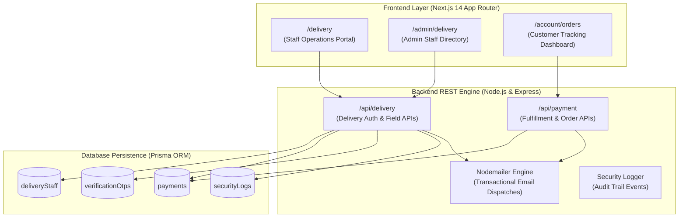
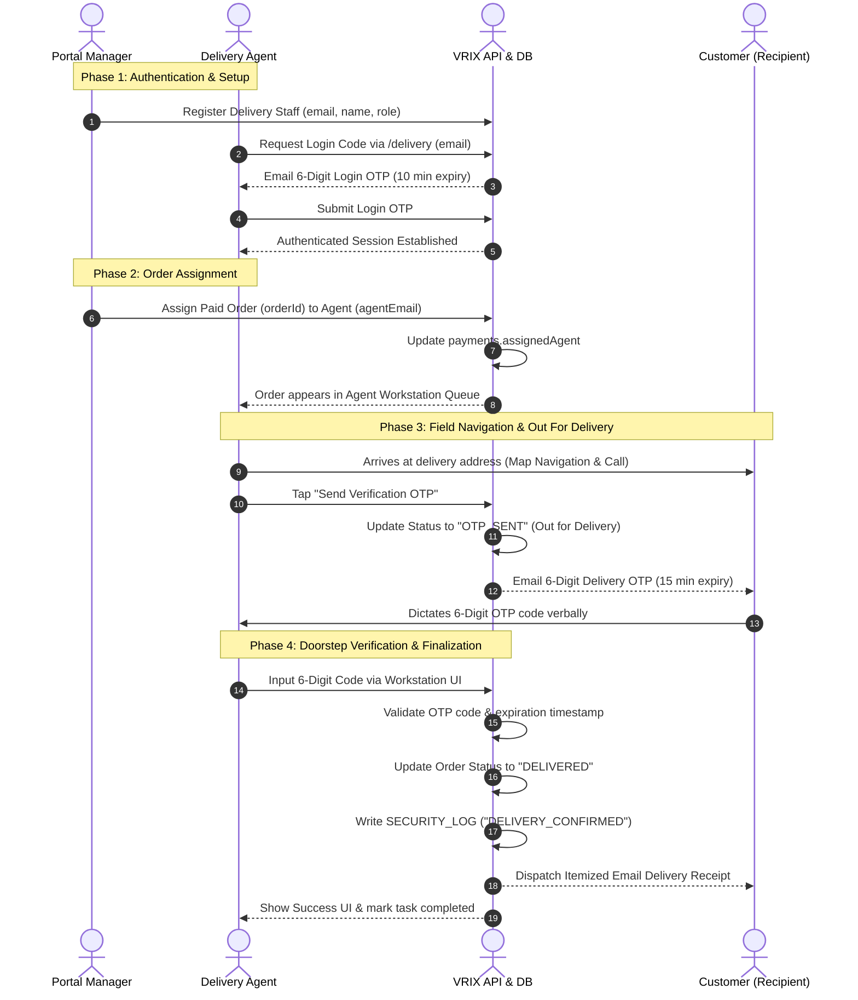

# 🚚 VRIX Luxury Delivery Operations System — Architecture & Workflow Guide

Welcome to the comprehensive technical documentation and operational guide for the **VRIX Delivery Operations & Customer Order Tracking Infrastructure**. 

This system handles end-to-end luxury order fulfillment, including passwordless OTP staff authentication, real-time manager order assignments, agent field routing, doorstep OTP verification, automated transactional email receipts, and customer tracking integration.

---

## 📌 Table of Contents
1. [System Overview & Architecture](#-system-overview--architecture)
2. [User Roles & Permissions Matrix](#-user-roles--permissions-matrix)
3. [End-to-End Operational Workflows](#-end-to-end-operational-workflows)
4. [Customer Order Tracking & Stepper Sync](#-customer-order-tracking--stepper-sync)
5. [Complete API Endpoints Reference](#-complete-api-endpoints-reference)
6. [Database Schemas & Persistence Models](#-database-schemas--persistence-models)
7. [Frontend UI Architecture & Aesthetics](#-frontend-ui-architecture--aesthetics)
8. [SMTP Email Dispatch & Dev Mode Fallbacks](#-smtp-email-dispatch--dev-mode-fallbacks)
9. [Security Audit & Compliance Features](#-security-audit--compliance-features)
10. [Developer Setup, Testing & Troubleshooting](#-developer-setup-testing--troubleshooting)

---

## 🏗️ System Overview & Architecture

The VRIX Delivery Subsystem operates as an integrated micro-service layer embedded within the VRIX E-Commerce core platform:



### Core Architecture Components:

* **Staff Operations Portal ([`/delivery`](file:///Frontend/src/app/(shop)/delivery/page.tsx)):** Dark glassmorphic workspace supporting passwordless 6-digit OTP login, manager control console, live order queue, QR barcode scanner mock, phone dialing, and Google Maps navigation.
* **Admin Staff Management ([`/admin/delivery`](file:///Frontend/src/app/(admin)/admin/delivery/page.tsx)):** Dedicated admin interface for creating manager/agent accounts, viewing staff directories, and revoking staff access.
* **Customer Order Dashboard ([`/account/orders`](file:///Frontend/src/app/(shop)/account/orders/page.tsx)):** Cartier-styled customer tracking hub with 4-step progress stepper, ETA calculation, and digital tax invoice links.
* **Backend Delivery API Engine ([`Backend/routes/delivery.js`](file:///Backend/routes/delivery.js)):** RESTful controller handling staff OTP auth, order assignment, customer OTP dispatch, doorstep verification, and delivery receipts.
* **Prisma Persistence Layer ([`Backend/prisma/schema.prisma`](file:///Backend/prisma/schema.prisma)):** Relational ORM managing staff credentials, payment order ledgers, temporary verification codes, and security audit logs.

---

## 👤 User Roles & Permissions Matrix

> [!IMPORTANT]
> System permissions are strictly controlled. Delivery Staff accounts are isolated from normal customer accounts, requiring explicit email whitelist registration by an Admin or Portal Manager.

| Role | Access Scope | Interfaces | Key System Capabilities |
| :--- | :--- | :--- | :--- |
| **Root Admin** | Full System | `/admin/delivery`<br/>`/admin/orders` | Create/Delete Managers & Agents, view platform analytics, update payment statuses. Root account (`manager@vrix.com`) is deletion-protected. |
| **Portal Manager** | Logistics Operations | `/delivery` *(Manager View)*<br/>`/admin/delivery` | View all active shipments, assign unassigned orders to agents, register new agents, view efficiency metrics. |
| **Delivery Agent** | Field Operations | `/delivery` *(Agent View)* | View assigned orders & open pool, navigate via Google Maps, phone customers, trigger doorstep OTP, verify 6-digit OTP. |
| **Customer** | End-User Client | `/account/orders`<br/>Email Inbox | Receive delivery OTP via email, track 4-step progress line, view ETA, receive final PDF tax invoice and email receipt. |

---

## 🔄 End-to-End Operational Workflows

### 1. Complete Doorstep Delivery Sequence



### Detailed Workflow Phase Breakdown:

1. **Staff Registration & Authentication**
   - Managers add staff via `/admin/delivery` or the Manager tab in `/delivery`.
   - Staff enter their email address to request a 6-digit access code.
   - An OTP valid for 10 minutes is generated and dispatched to the staff inbox (or printed in the dev console).
   - Upon successful entry, a session is saved to `localStorage` (`vrix_delivery_user`).

2. **Order Assignment & Queue Management**
   - Paid orders (`status = "SUCCESS"`) enter the logistics pool.
   - Managers assign shipments to specific agents. Unassigned shipments remain in the **Open Pool** for any agent to claim.
   - Agents see real-time task counts and customer addresses in their mobile workstation.

3. **Doorstep Arrival & OTP Generation**
   - On arrival, the agent taps **"Send Verification OTP"**.
   - The order status updates to `OTP_SENT` (Out for Delivery).
   - A 15-minute expiration OTP code is automatically sent to the customer's email.

4. **Doorstep OTP Verification & Receipt Dispatch**
   - The customer provides the code verbally.
   - The agent enters the code in the workstation (supports segmented inputs & auto-paste).
   - Backend validates the OTP:
     * **Valid:** Order status is updated to `DELIVERED`, a `DELIVERY_CONFIRMED` audit log is saved, and an official **Delivery Receipt Email** is dispatched to the customer.
     * **Invalid/Expired:** The system blocks handoff and prompts for re-entry or code re-dispatch.

---

## 📈 Customer Order Tracking & Stepper Sync

The customer tracking dashboard ([`/account/orders`](file:///Frontend/src/app/(shop)/account/orders/page.tsx)) automatically synchronizes with database statuses:

| Status in DB | Milestone Stepper Progress | ETA Display Logic | Visual Badge Style |
| :--- | :--- | :--- | :--- |
| `CREATED` | Step 1: Order Placed (25%) | `Arriving by [Date + 7 Days]` | Amber Badge (`Order Placed`) |
| `SUCCESS` / `PAID` | Step 2: In Preparation (50%) | `Arriving by [Date + 7 Days]` | Blue Badge (`Paid & Processing`) |
| `OTP_SENT` | Step 3: Out for Delivery (75%) | 🚚 **Arriving Today — Courier in Transit** | Purple Badge with Pulse (`Out for Delivery`) |
| `DELIVERED` | Step 4: Delivered (100%) | ✅ **Delivered on [Actual Date]** | Emerald Badge with Check (`Delivered`) |
| `FAILED` / `CANCELLED` | Step 0: Cancelled (0%) | Order Cancelled | Rose Badge (`Cancelled / Failed`) |

---

## 📡 Complete API Endpoints Reference

All endpoints are hosted on the backend server under `/api/delivery` and `/api/payment`.

### 1. Delivery Staff Authentication & Management

#### `POST /api/delivery/auth/login`
Generates and dispatches a 6-digit staff login OTP code (10-minute expiry).
* **Request Body:**
  ```json
  { "email": "agent@vrix.com" }
  ```
* **Response (200 OK):**
  ```json
  { "success": true, "message": "Login OTP sent to agent@vrix.com" }
  ```

#### `POST /api/delivery/auth/verify`
Verifies staff login OTP and returns staff profile details.
* **Request Body:**
  ```json
  { "email": "agent@vrix.com", "otp": "849201" }
  ```
* **Response (200 OK):**
  ```json
  { "success": true, "user": { "email": "agent@vrix.com", "name": "John Doe", "role": "agent" } }
  ```

#### `GET /api/delivery/orders`
Retrieves shipment logs. Filterable by role and staff email.
* **Query Parameters:** `?role=agent&email=agent@vrix.com`
* **Response (200 OK):** Array of order payment objects.

#### `PATCH /api/delivery/orders/:orderId/assign`
Assigns or unassigns a shipment to a delivery agent.
* **Request Body:**
  ```json
  { "agentEmail": "agent@vrix.com" }
  ```

#### `GET /api/delivery/staff` & `POST /api/delivery/staff`
Fetch staff directory or register a new staff member.
* **POST Request Body:**
  ```json
  { "email": "newagent@vrix.com", "name": "Jane Smith", "role": "agent" }
  ```

#### `DELETE /api/delivery/staff/:email`
Revokes staff access by deleting their staff account.

---

### 2. Doorstep Verification & Customer Dispatches

#### `POST /api/delivery/send-otp`
Dispatches a 15-minute customer verification OTP and updates order status to `OTP_SENT`.
* **Request Body:**
  ```json
  { "orderId": "order_dev_1710000000", "customerEmail": "client@gmail.com" }
  ```
* **Response (200 OK):**
  ```json
  { "success": true, "message": "Delivery OTP sent to client@gmail.com" }
  ```

#### `POST /api/delivery/verify-otp`
Verifies customer OTP, updates status to `DELIVERED`, records audit log, and sends final email receipt.
* **Request Body:**
  ```json
  { "orderId": "order_dev_1710000000", "otp": "592814" }
  ```
* **Response (200 OK):**
  ```json
  { "success": true, "orderId": "order_dev_1710000000", "message": "Delivery confirmed successfully" }
  ```

---

### 3. Order Tracking Lookup

#### `GET /api/payment/track/:query`
Public endpoint allowing instant order tracking lookup by `orderId` or `paymentId`.
* **Example:** `GET /api/payment/track/order_dev_1710000000`
* **Response (200 OK):**
  ```json
  {
    "success": true,
    "order": {
      "orderId": "order_dev_1710000000",
      "amount": 24500,
      "status": "OTP_SENT",
      "customerName": "Elena Vance",
      "address": "42 Luxury Avenue",
      "city": "Mumbai",
      "postalCode": "400001"
    }
  }
  ```

---

## 🗄️ Database Schemas & Persistence Models

Defined in Prisma [`Backend/prisma/schema.prisma`](file:///Backend/prisma/schema.prisma):

```prisma
model deliveryStaff {
  id        String   @id @default(uuid())
  email     String   @unique
  name      String
  role      String   // "agent" | "manager"
  createdAt DateTime @default(now())
  updatedAt DateTime @updatedAt
}

model payments {
  id            String   @id @default(uuid())
  orderId       String   @unique
  amount        Float
  currency      String   @default("INR")
  status        String   // "CREATED" | "SUCCESS" | "OTP_SENT" | "DELIVERED" | "FAILED"
  paymentId     String?
  customerName  String?
  customerPhone String?
  address       String?
  city          String?
  postalCode    String?
  userEmail     String?
  assignedAgent String?  // Stores assigned agent email
  cartItems     String?  // JSON stringified items
  isGiftWrapped Boolean  @default(false)
  giftMessage   String?
  giftWrapPrice Float?
  createdAt     DateTime @default(now())
  updatedAt     DateTime @updatedAt
}

model verificationOtps {
  id        String   @id @default(uuid())
  email     String   // Key format: "delivery_auth:staff@email.com" OR "delivery:order_123"
  otp       String
  expiresAt String
}

model securityLogs {
  id        String   @id @default(uuid())
  event     String   // "DELIVERY_STAFF_LOGIN" | "DELIVERY_ASSIGNED" | "DELIVERY_CONFIRMED"
  user      String
  status    String   // "SUCCESS" | "FAILED"
  createdAt DateTime @default(now())
}
```

---

## 🎨 Frontend UI Architecture & Aesthetics

### 1. Delivery Workstation ([`/delivery`](file:///Frontend/src/app/(shop)/delivery/page.tsx))
* **Dark Glassmorphism:** Styled with background glows (`#070913`), blurred backdrop overlays, and semi-transparent cards.
* **Segmented OTP Inputs:** Custom 6-digit input boxes supporting automatic focus transitions and clipboard paste.
* **Direct Field Actions:** Instant `tel:` protocol calling buttons and Google Maps deep-links (`https://www.google.com/maps/search/?api=1&query=...`).
* **Barcode Scanner Simulation:** Built-in scanner modal overlay for simulated package scanning in the field.

### 2. Admin Staff Manager ([`/admin/delivery`](file:///Frontend/src/app/(admin)/admin/delivery/page.tsx))
* **Light Minimalist Theme:** Deep navy typography with subtle grey borders matching the main admin panel.
* **Protected System Accounts:** Built-in safeguard preventing accidental removal of root manager credentials (`manager@vrix.com`).

---

## ✉️ SMTP Email Dispatch & Dev Mode Fallbacks

Email notifications are dispatched via Nodemailer resolved in `Backend/config/apiResolvers.js`:

```env
# Production SMTP Configuration (.env)
SMTP_HOST=smtp.gmail.com
SMTP_PORT=587
SMTP_USER=info@vrixjewels.com
SMTP_PASS=your_app_password
```

> [!TIP]
> **Developer Mode Fallback:** If SMTP credentials are missing, the server automatically operates in **Dev Mode**. Generated OTPs will print directly to the server terminal console:
> ```bash
> [DEV] Delivery Auth OTP for agent@vrix.com: 849201
> [DEV] Delivery OTP for order order_dev_1710000000: 592814
> ```

---

## 🛡️ Security Audit & Compliance Features

> [!SECURITY]
> Security is enforced at every layer of the delivery lifecycle to prevent package misplacement, unauthorized access, or brute-force code verification.

1. **OTP Expiration Rules:** Staff login codes expire after **10 minutes**; customer doorstep delivery codes expire after **15 minutes**.
2. **Audit Logging:** Every critical action creates an immutable log record in the `securityLogs` table:
   * `DELIVERY_STAFF_LOGIN`: Records staff authentication attempts.
   * `DELIVERY_ASSIGNED`: Logs manager assignment of orders to agent emails.
   * `DELIVERY_CONFIRMED`: Records doorstep handoffs verified by OTP.
3. **Protected Root Manager:** Root manager (`manager@vrix.com`) cannot be deleted or revoked via API or UI.

---

## 🧪 Developer Setup, Testing & Troubleshooting

### Pre-Configured Test Accounts:
* **Manager Credentials:** `manager@vrix.com`
* **Agent Credentials:** `agent@vrix.com`

### End-to-End Testing Walkthrough:

1. **Start Backend & Frontend Services:**
   ```bash
   # Terminal 1: Backend (Port 5000)
   cd Backend && npm start

   # Terminal 2: Frontend (Port 3000)
   cd Frontend && npm run dev
   ```

2. **Test Agent Login Flow:**
   * Open [`http://localhost:3000/delivery`](http://localhost:3000/delivery).
   * Enter `agent@vrix.com` and click **Request Login Code**.
   * Copy the 6-digit code printed in the Backend terminal.
   * Enter code to access the Agent Workstation.

3. **Test Doorstep Delivery & OTP Flow:**
   * Select an active shipment from the task queue.
   * Click **Send Verification OTP**.
   * Copy the delivery OTP code from the backend console output.
   * Enter the code into the verification input boxes and click **Confirm Delivery**.
   * Verify that the shipment status changes to **DELIVERED** with an emerald checkmark!

4. **Verify Customer Tracking:**
   * Open [`http://localhost:3000/account/orders`](http://localhost:3000/account/orders).
   * Paste the Order ID into the tracking search box.
   * Observe the 4-step progress stepper updated to 100% Delivered!

---
*Maintained by VRIX Engineering Team · Luxury Architectural Fine Jewelry Platform.*
